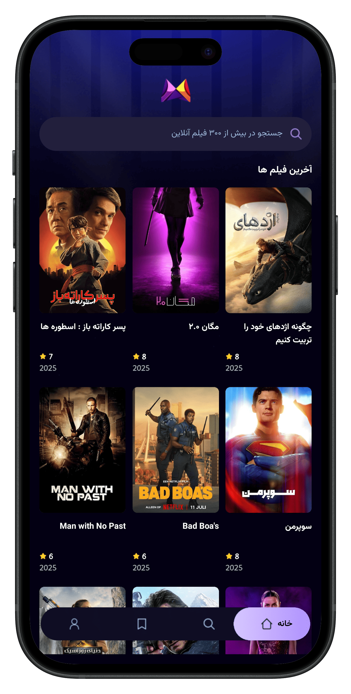
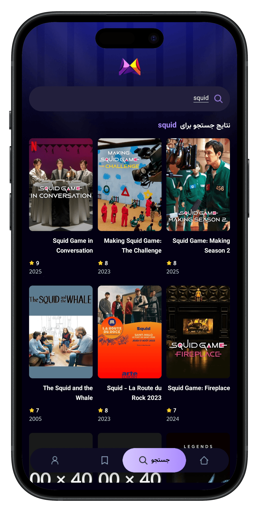

# 🎬 Movie Flix

<div align="center">
  
  
  
  
  
</div>

<div align="center">
  <h3>🌟 Discover Movies & TV Shows 🌟</h3>
  <p>A modern and beautiful mobile app for exploring movies and TV shows</p>
</div>

## 🎨 Screenshots

<div align="center">
  
  
  
</div>

## ✨ Key Features

🎯 **Smart Search** - Find movies and TV shows with lightning speed
🔥 **Trending Content** - Latest and most popular movies and series
📱 **Responsive Design** - Optimized user experience across all devices
⚡ **High Performance** - Smart caching and fast loading
🎨 **Beautiful UI** - Modern and user-friendly interface
🌐 **Up-to-date Data** - Direct connection to TMDB database

## 🚀 Tech Stack

- **React Native** - Mobile app development framework
- **Expo** - Development and deployment platform
- **Tailwind CSS (NativeWind)** - Modern and responsive styling
- **React Query** - Data fetching and state management
- **TMDB API** - Global movie and TV show database

## 📦 Installation & Setup

### Prerequisites

```bash
# Install Node.js (version 18 or higher)
# Install npm or yarn
# Install Expo CLI
npm install -g @expo/cli
```

### Installation Steps

1. **Clone the repository**

```bash
git clone https://github.com/alirezashn79/movie-flix.git
cd movie-flix
```

2. **Install dependencies**

```bash
npm install
# or
yarn install
```

3. **Setup API Key**

```bash
# Create .env file and add your API key
TMDB_API_KEY=your_api_key_here
```

4. **Run the project**

```bash
npm start
# or
yarn start
```

## 🎮 Usage

### Run on different platforms

```bash
# iOS Simulator
npm run ios

# Android Emulator
npm run android

# Web (for testing)
npm run web
```

### Scan QR Code

1. Install Expo Go app on your mobile device
2. Scan the displayed QR code
3. Enjoy the app! 🎉

## 🏗️ Project Structure

```
movie-flix/
├── src/
│   ├── components/     # Reusable components
│   ├── screens/        # Main app screens
│   ├── services/       # API calls and React Query
│   ├── utils/          # Helper functions
│   └── types/          # TypeScript types
├── assets/             # Images and static files
├── app.json           # Expo configuration
└── package.json       # Dependencies and scripts
```

## 🚧 Upcoming Features

- [ ] Favorites and watchlist system
- [ ] User reviews and ratings
- [ ] Multi-language support
- [ ] Dark/Light mode
- [ ] Notifications for new releases
- [ ] User profiles

## 🙏 Acknowledgments

- [JavaScript Mastery](https://www.youtube.com/@javascriptmastery) Mastery for excellent tutorials and inspiration
- [TMDB](https://www.themoviedb.org/) for providing free and comprehensive API
- React Native community for amazing tools and resources
- All contributors who helped improve this project

---

<div align="center">
  <p>⭐ If this project helped you, please give it a star!</p>
  <p>Made with ❤️ by Alireza Shahin</p>
</div>
